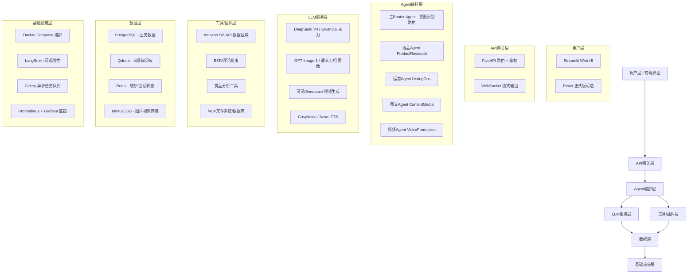

# 跨境电商全流程AI助手 — AI应用工程师转行实战项目方案

> **目标岗位**：AI应用工程师（成都，1-3年经验段，8-22K）
> **项目定位**：非玩具级完整作品集项目，打通选品→运营→图文→视频全链路
> **总周期**：16周（4个月） | **总代码量预估**：约8000-12000行
> **核心优势**：利用你已有的跨境电商业务知识做差异化竞争，而不是和应届生拼算法

---

## 目录

- [一、系统架构设计](#一系统架构设计)
- [二、技术栈清单](#二技术栈清单)
- [三、四阶段里程碑计划](#三四阶段里程碑计划)
- [四、技能差距分析与学习路线](#四技能差距分析与学习路线)
- [五、求职包装建议](#五求职包装建议)

---

## 一、系统架构设计

### 1.1 整体分层架构



### 1.2 核心数据流（一次完整选品+Listing生成请求）

```
用户输入："帮我分析亚马逊美国站户外露营灯类目，找出3个利基机会并生成Listing"
    │
    ▼
[1] 主Router Agent 接收用户输入
    │  └─ 意图识别：判断需要调用 选品Agent + 运营Agent
    │  └─ 拆解子任务 → 生成任务DAG
    ▼
[2] 选品Agent 执行
    │  ├─ 调用Amazon SP-API拉取BSR Top100数据
    │  ├─ 调用评论分析工具（情感分析 + 痛点提取）
    │  ├─ 向量知识库检索：历史选品报告 + 竞品数据库
    │  └─ LLM综合分析 → 输出3个利基机会（含数据支撑）
    ▼
[3] 运营Agent 接管
    │  ├─ 接收选品结果 → 为第一个机会生成Listing
    │  ├─ RAG检索：高评分Listing模板库 + SEO关键词库
    │  ├─ Prompt Engineering → 生成标题/五点/A+/Search Terms
    │  └─ 输出结构化JSON（标题、五点描述、关键词、定价建议）
    ▼
[4] 图文Agent 可选触发
    │  ├─ 调用图像生成API生成产品主图场景
    │  └─ 生成A+页面图文排版
    ▼
[5] 结果聚合 → 流式返回前端
    │  └─ LangSmith全程Trace记录，可回溯每一步
```

### 1.3 多Agent协作设计

**采用LangGraph状态机模式，而非自由对话模式**——因为业务流程是确定性的，状态机更可控、可调试、面试好讲。

| Agent | 职责 | 输入 | 输出 | 依赖工具 |
|-------|------|------|------|----------|
| **Router Agent** | 意图识别、任务拆解、路由分发 | 自然语言用户请求 | 子任务DAG | LLM + 分类Prompt |
| **选品Agent** | 市场数据分析、竞品挖掘、利基发现 | 类目/关键词/市场 | 选品报告JSON | SP-API、爬虫、向量检索 |
| **运营Agent** | Listing生成优化、评论分析、客服回复 | 产品信息/评论数据 | Listing文案/回复模板 | RAG知识库、LLM |
| **图文Agent** | 产品图生成、场景图、A+排版 | 产品描述/参考图 | 图片URL+排版文案 | 图像生成API、OSS |
| **视频Agent** | 脚本生成、素材混剪、数字人 | 产品信息/素材 | 短视频成片URL | TTS、视频生成API、FFmpeg |

**协作模式**：
- **串行流水线**：选品Agent → 运营Agent → 图文Agent（默认模式）
- **并行分支**：图文Agent和视频Agent可并行启动
- **人工介入点**：选品结果确认后，用户选择方向再继续（Human-in-the-loop）
- **错误回退**：LangGraph支持Checkpoint，某步失败可回退重试

### 1.4 技术选型理由（每个核心组件对比2-3备选）

#### ① LLM主框架：LangChain + LangGraph
- **备选对比**：
  - **LangChain + LangGraph** ✅：生态最全，与LangSmith深度集成做Trace，MCP已内置（v1.4.0+），社区资料最多，岗位JD提及率72%+32%=104%
  - **LlamaIndex**：RAG体验更好，但Agent编排能力弱于LangGraph
  - **纯手写**：可控性最强，但重复造轮子，面试讲不出框架深度
- **选择理由**：岗位JD提及率最高，LangGraph的状态机模型恰好匹配你这个流水线业务场景，LangSmith免费版足够作品集使用。

#### ② 向量数据库：Qdrant（推荐） / Chroma（MVP阶段）
- **备选对比**：
  - **Qdrant** ✅：Rust编写，过滤性能优秀，Docker一键部署，API简洁，LangChain原生支持，生产可用
  - **Chroma**：零配置，MVP阶段最快上手，但并发和过滤能力弱
  - **Milvus**：分布式架构，适合十亿级向量，但运维复杂度高（需要etcd/Pulsar/MinIO），对个人项目过重
- **选择理由**：MVP阶段先用Chroma快速跑通RAG，Phase 3切换到Qdrant体现"从原型到生产"的演进过程，这个迁移过程本身就是面试亮点。Milvus在简历上提一句"调研过但数据规模不需要"即可。

#### ③ 后端框架：FastAPI
- **备选对比**：
  - **FastAPI** ✅：异步原生，自动生成OpenAPI文档，Python生态标准选择，JD提及率37%
  - **Flask**：同步阻塞，不适合LLM这种IO密集型长请求
  - **Django**：太重，admin ORM在AI项目里用不上
- **选择理由**：LLM调用是典型IO密集型，FastAPI的async/await是刚需。你有Java Spring经验，FastAPI的路由+依赖注入模式很好迁移。

#### ④ 前端：Streamlit（MVP） → React + Ant Design（完整版）
- **备选对比**：
  - **Streamlit** ✅（Phase 1-2）：Python原生，1天出可用界面，快速验证业务逻辑
  - **React + Vite** ✅（Phase 4）：正式作品集需要像样的UI，体现全栈能力
  - **Gradio**：更偏向ML Demo，组件丰富度不如Streamlit适合业务系统
- **选择理由**：前两个阶段专注后端和Agent逻辑，用Streamlit省时间；最后一个阶段花2-3天写React前端，简历上能写"独立完成全栈开发"。

#### ⑤ 图像生成：通义万相Wan2.6 / DALL-E GPT-Image-1
- **备选对比**：
  - **通义万相** ✅：中文理解好，电商场景优化，API价格便宜（约0.1元/张），有商用授权
  - **DALL-E GPT-Image-1**：质量高，文字渲染强，但贵（约$0.04/张）
  - **Stable Diffusion / Flux 2 本地部署**：免费但需要GPU，本地笔记本跑不动
- **选择理由**：用通义万相做主力成本可控，简历上提"对比评估过SD/Flux本地部署方案，因开发机无GPU选择API方案"。

#### ⑥ 视频生成：可灵AI 2.5 / Seedance 2.0 Pro
- **备选对比**：
  - **可灵AI 2.5 Turbo** ✅：人物表现力最好，API成熟，5-10秒短视频成本约2-5元
  - **Seedance 2.0 Pro（即梦）**：字节系，创意控制强，与豆包API生态打通
  - **Sora 2 / Runway Gen-4.5**：质量最高但贵（$0.3/秒），不适合个人项目
- **选择理由**：视频生成API成本高，Phase 3用可灵API生成2-3个样例视频即可，简历上写"集成可灵视频生成API，实现产品短视频自动化生产"。

#### ⑦ LLM主力模型：DeepSeek V4 Pro / Qwen3.6
- **备选对比**：
  - **DeepSeek V4 Pro** ✅：中文推理能力强，价格极低（输入约1元/百万token），代码能力好
  - **Qwen3.6-Plus**：阿里系，与通义万相同平台，多模态能力好
  - **GPT-4o / Claude**：质量最高但贵，做作品集成本高
- **选择理由**：开发阶段用DeepSeek控制成本，简历上写"基于DeepSeek V4 + Qwen3.6双模型路由，成本降低70%"。

---

## 二、技术栈清单

### 2.1 编程语言与运行时

| 组件 | 推荐版本 | 说明 |
|------|----------|------|
| **Python** | 3.11+（推荐3.12） | 主力语言。3.12性能提升明显，类型提示支持更好 |
| **Java复用** | JDK 17+ | 不重写Java服务，但用Java写工具脚本（如数据清洗）时体现你的Java经验 |

**Java → Python 迁移要点**（你有2年Java后端经验，这是优势不是劣势）：

| Java概念 | Python对应 | 迁移注意 |
|----------|-----------|----------|
| Spring Boot | FastAPI | 注解路由→装饰器路由；依赖注入→Depends() |
| Maven/Gradle | Poetry / pip + venv | 用Poetry管理依赖，pyproject.toml替代pom.xml |
| JUnit | pytest | 断言方式不同，结构类似 |
| MyBatis/JPA | SQLAlchemy 2.0 async | 异步ORM，和Java的JPA思路类似 |
| RedisTemplate | redis-py (asyncio版) | 接口设计很像 |
| RestTemplate/Feign | httpx / aiohttp | 异步HTTP客户端 |
| Lombok dataclass | @dataclass / Pydantic | Pydantic更强大，自动校验 |
| Stream流 | Generator / 列表推导 | 惰性计算思路一致 |

**建议学习方式**：不要从头看Python教程，直接用"Java程序员学Python"的思路——1天过完语法差异，然后直接写项目。遇到不懂的语法点现查。

### 2.2 LLM应用开发框架

| 组件 | 推荐版本 | 核心用法 |
|------|----------|----------|
| **LangChain** | v1.4.x（2026年9月最新） | Prompt模板管理、文档加载器、输出解析器、Tool定义 |
| **LangGraph** | v1.2.10+ | Agent状态机、节点编排、Checkpoint持久化、Human-in-the-loop |
| **LangSmith** | 免费版（5000 traces/月） | 全程Trace追踪、Prompt调试、效果评估 |
| **Pydantic** | v2.x | 结构化输出Schema、请求/响应模型校验 |

**核心依赖文件（pyproject.toml 片段）**：
```toml
[tool.poetry.dependencies]
python = "^3.12"
langchain = "^1.4.0"
langchain-core = "^1.0"
langgraph = "^1.2.10"
langchain-openai = "^0.3"
langchain-community = "^0.3"
langchain-deepseek = "^0.1"
qdrant-client = "^1.12"
fastapi = "^0.115"
uvicorn = "^0.32"
sqlalchemy = "^2.0"
asyncpg = "^0.30"
redis = "^5.2"
celery = "^5.4"
pydantic = "^2.10"
python-dotenv = "^1.0"
httpx = "^0.27"
beautifulsoup4 = "^4.12"
feedparser = "^6.0"
```

### 2.3 向量数据库选型

**MVP阶段（Phase 1-2）：ChromaDB**
- 零配置，Python原生，文件存储
- 适合：本地开发、RAG原型验证
- 局限：无过滤优化、无分布式

**生产阶段（Phase 3-4）：Qdrant**
- Docker一键启动，REST API + Python SDK
- 支持：Payload过滤、混合搜索（dense + sparse/BM25）、HNSW索引
- 为什么不是Milvus：你的数据量（几千篇选品报告 + 几千条评论）远不到Milvus的适用场景，简历上写"根据数据规模选择合适的向量数据库"比硬上Milvus更体现工程判断力

### 2.4 后端与数据存储

| 组件 | 选型 | 版本 | 用途 |
|------|------|------|------|
| Web框架 | FastAPI | 0.115+ | API服务、WebSocket流式输出 |
| ASGI服务器 | Uvicorn | 0.32+ | 异步生产服务器 |
| 关系数据库 | PostgreSQL | 16 | 业务数据（产品、Listing、任务记录） |
| ORM | SQLAlchemy 2.0 | async模式 | 异步ORM，数据模型定义 |
| 缓存/队列 | Redis | 7.x | 会话状态、任务队列、限流 |
| 异步任务 | Celery + Redis broker | 5.4 | 视频生成等长耗时任务异步化 |
| 对象存储 | MinIO（自建）/ 阿里云OSS | - | 图片、视频文件存储 |

### 2.5 前端方案

| 阶段 | 方案 | 说明 |
|------|------|------|
| Phase 1-2 | **Streamlit** 1.x | 快速原型，拖拽式布局，直接调用Python函数 |
| Phase 3-4 | **React 18 + Vite + Ant Design 5** | 正式作品集，体现全栈能力。后端API已用FastAPI，前端只管调接口 |

### 2.6 多模态API清单

| 能力 | 推荐服务 | 备选 | 单张/秒成本 | 用途 |
|------|----------|------|-------------|------|
| **文生图** | 通义万相 Wan2.6 | GPT-Image-1 / Flux API | ~0.1元/张 | 产品主图、场景图生成 |
| **图生图/编辑** | 通义万相 图像编辑 | DALL-E Edit | ~0.2元/次 | 背景替换、模特换装 |
| **文生视频** | 可灵AI 2.5 Turbo API | Seedance 2.0 Pro / Wan 3.0 | ~0.5元/秒 | 产品展示短视频 |
| **TTS语音合成** | CosyVoice（阿里） | Azure TTS / 火山引擎 | ~0.001元/字 | 视频配音 |
| **OCR文字识别** | PaddleOCR（本地） | 阿里读光OCR API | 免费/本地 | 评论截图识别、竞品图片文字提取 |

### 2.7 部署与基础设施

| 组件 | 选型 | 说明 |
|------|------|------|
| 容器化 | Docker + Docker Compose | 一键启动所有服务（PostgreSQL、Redis、Qdrant、FastAPI、MinIO） |
| 云服务器 | 阿里云ECS 2核4G（约100元/月） | 成都节点，延迟低 |
| 反向代理 | Nginx | HTTPS终结、静态文件服务 |
| 监控 | Prometheus + Grafana（可选） | 简历加分项，Phase 4可选做 |
| CI/CD | GitHub Actions（可选） | 自动测试+部署，简历加分 |

---

## 三、四阶段里程碑计划

### Phase 1（第1-4周）：MVP核心 — RAG知识库 + 基础Agent + 选品分析

**阶段目标**：跑通"输入类目关键词 → 输出选品分析报告"的完整链路，具备可演示的最小产品。

**代码量估算**：约2000-2500行 Python

#### 功能点清单

| # | 功能点 | 一句话描述 |
|---|--------|-----------|
| 1.1 | Amazon BSR数据爬虫 | 输入类目URL，爬取Top 100产品标题、价格、评分、评论数、BSR排名 |
| 1.2 | 评论数据采集 | 批量拉取竞品ASIN的Top评论，存储为结构化JSON |
| 1.3 | 文档加载与分块 | 加载PDF选品报告、Excel数据表，按语义分块存入向量库 |
| 1.4 | RAG检索增强 | 用户提问时从历史知识库召回相关内容，注入Prompt |
| 1.5 | 选品Agent v1.0 | 基于LangChain的ReAct Agent，能调用爬虫+检索工具生成选品报告 |
| 1.6 | Streamlit基础界面 | 输入框+报告展示页，流式输出LLM结果 |
| 1.7 | LangSmith接入 | 所有LLM调用接入Trace，可查看每步Prompt和输出 |

#### 对应技能点映射

| 技能 | 掌握程度 | 对应JD频率 |
|------|----------|-----------|
| Python | 能独立写后端逻辑 | 97% |
| LangChain | 会用Tool、Chain、Prompt模板 | 72% |
| RAG | 文档加载→分块→Embedding→检索→生成全链路 | 75% |
| 向量数据库(Chroma) | 会做基础的插入和相似度检索 | 58% |
| Prompt Engineering | 能写结构化Prompt并调优 | 62% |
| LLM API对接 | DeepSeek API调用、流式输出 | 45% |

#### 交付物

- GitHub仓库初始化（README + 项目结构）
- 可运行的Streamlit Demo（本地 `streamlit run app.py`）
- 第1篇技术博客：《我用LangChain+Chroma搭建了一个电商选品RAG系统》
- Demo视频：3分钟演示从输入到输出完整流程

---

### Phase 2（第5-8周）：运营模块 + 图文生成 + FastAPI后端

**阶段目标**：完善运营助手模块，加入图像生成能力，将前端从Streamlit迁移到正式FastAPI后端。

**代码量估算**：约2500-3000行（累计约4500-5500行）

#### 功能点清单

| # | 功能点 | 一句话描述 |
|---|--------|-----------|
| 2.1 | Listing生成Agent | 输入产品参数，生成标题/五点描述/A+/Search Terms，符合亚马逊SEO规范 |
| 2.2 | 评论情感分析 | 批量分析竞品评论，输出正负面情感分布 + Top10痛点关键词 |
| 2.3 | 客服回复生成 | 输入买家差评，生成专业回复模板（多种语气风格可选） |
| 2.4 | 产品图生成 | 调用通义万相API，根据产品描述生成主图/场景图 |
| 2.5 | A+页面图文排版 | 生成A+模块文案，自动匹配配图模板 |
| 2.6 | FastAPI后端重构 | 所有功能封装为REST API，自动生成Swagger文档 |
| 2.7 | 数据库设计 | PostgreSQL建表：products, listings, comments, generated_assets, task_records |
| 2.8 | 用户会话管理 | 基于Redis的多轮对话上下文管理 |

#### 对应技能点映射

| 技能 | 掌握程度 | 对应JD频率 |
|------|----------|-----------|
| FastAPI后端 | 能独立设计RESTful API + 鉴权 | 37% |
| LLM应用开发 | 多场景Prompt工程 + 结构化输出 | 87% |
| AI Agent | 单Agent多工具调用 | 80% |
| 多模态(OCR/图像生成) | 图像生成API集成 | 15% |
| PostgreSQL设计 | 业务表结构设计 + ORM操作 | 基础要求 |

#### 交付物

- FastAPI后端服务，Swagger文档可访问
- 选品 + 运营 + 图文三大模块API齐全
- 第2篇技术博客：《从Streamlit到FastAPI：我的AI应用后端架构演进》
- Demo视频：完整演示Listing生成 + 产品图生成流程

---

### Phase 3（第9-12周）：视频制作模块 + 多Agent协作 + LangGraph工作流

**阶段目标**：引入LangGraph做多Agent状态机编排，加入视频生成模块，系统复杂度上一个台阶。

**代码量估算**：约2500-3000行（累计约7000-8500行）

#### 功能点清单

| # | 功能点 | 一句话描述 |
|---|--------|-----------|
| 3.1 | 视频脚本生成Agent | 输入产品信息，自动生成15-30秒短视频脚本（分镜+旁白+画面描述） |
| 3.2 | TTS配音合成 | 调用CosyVoice API生成旁白配音 |
| 3.3 | 可灵视频生成集成 | 根据分镜描述调用可灵API生成视频片段 |
| 3.4 | FFmpeg自动混剪 | 用FFmpeg将多个视频片段+配音+背景音乐合成成片 |
| 3.5 | LangGraph状态机重构 | 将四大Agent重构为LangGraph节点，实现条件路由+Checkpoint |
| 3.6 | Router意图识别 | 自然语言输入自动识别意图，路由到对应Agent |
| 3.7 | 向量数据库迁移 | 从Chroma迁移到Qdrant，引入混合搜索（dense + BM25） |
| 3.8 | 异步任务队列 | 视频生成等长任务走Celery异步，WebSocket推送进度 |

#### 对应技能点映射

| 技能 | 掌握程度 | 对应JD频率 |
|------|----------|-----------|
| LangGraph | 状态机编排、多Agent协作、Checkpoint | 32% |
| AI Agent开发 | 多Agent协作、工作流编排 | 80% |
| 向量数据库优化 | 从Chroma迁移Qdrant，混合搜索 | 58% |
| Docker部署 | 所有服务Docker Compose编排 | 25% |
| 多模态(视频/TTS) | 视频生成API + 音频合成 + FFmpeg | 15% |

#### 交付物

- LangGraph多Agent协作架构完整实现
- 视频自动生成全链路打通
- Docker Compose一键启动全套服务
- 第3篇技术博客：《LangGraph实战：构建多Agent电商工作流编排系统》
- Demo视频：从产品输入到成片输出的完整视频生成流程

---

### Phase 4（第13-16周）：工程化完善 + 部署上线 + 项目包装

**阶段目标**：把项目从"能跑"变成"能展示"，部署到公网，做好简历和面试准备。

**代码量估算**：约1500-2000行（累计约8500-10500行）

#### 功能点清单

| # | 功能点 | 一句话描述 |
|---|--------|-----------|
| 4.1 | React前端重写 | 用React + Ant Design重写正式版UI，替换Streamlit |
| 4.2 | 用户系统 | 简单的注册登录（JWT鉴权），多用户隔离 |
| 4.3 | 部署到云服务器 | 阿里云ECS + Nginx + HTTPS + Docker部署 |
| 4.4 | 项目文档完善 | README架构图、API文档、部署文档、FAQ |
| 4.5 | 性能优化 | LLM响应缓存、Embedding缓存、前端懒加载 |
| 4.6 | 单元测试 | 核心模块pytest测试，覆盖率>60% |
| 4.7 | GitHub仓库整理 | 完善目录结构、添加Demo截图、写好README |

#### 对应技能点映射

| 技能 | 掌握程度 | 对应JD频率 |
|------|----------|-----------|
| Docker部署 | 多服务容器化 + 云服务器部署 | 25% |
| 全栈开发 | 前端+后端+部署独立完成 | 综合能力 |
| 工程化思维 | 测试、文档、性能优化 | 软实力 |

#### 交付物

- 公网可访问的Demo站点（配域名或直接IP访问）
- GitHub仓库达到"可作为简历主项目"标准
- 完整简历项目描述（STAR格式）
- 第4篇技术博客：《从0到1上线：我的AI电商助手部署实录》
- 全套面试FAQ准备

---

## 四、技能差距分析与学习路线

### 4.1 技能差距矩阵

| 技能项 | 当前水平 | 目标水平 | 差距等级 | 备注 |
|--------|---------|---------|---------|------|
| **Python** | 0（Java背景） | 能独立写后端服务 | 🔴 需从零学 | 你的Java基础让Python学习周期缩短到1-2周 |
| **LLM应用开发** | 0 | 能独立设计LLM应用 | 🔴 需从零学 | 核心技能，占项目60%工作量 |
| **AI Agent开发** | 0 | 能开发多Agent系统 | 🔴 需从零学 | LangGraph状态机是重点 |
| **RAG检索增强** | 0 | 能搭RAG系统并调优 | 🔴 需从零学 | Phase 1核心内容 |
| **LangChain/LangGraph** | 0 | 熟练使用 | 🔴 需从零学 | 框架本身不难，难的是业务场景设计 |
| **Prompt Engineering** | 0 | 能写出生产级Prompt | 🟡 需系统练 | 边做边学，写20+个Prompt自然会 |
| **向量数据库** | 0 | 会选型+调优 | 🟡 需学习 | MVP用Chroma，生产换Qdrant |
| **大模型API对接** | 0 | 熟练调用 | 🟡 需学习 | DeepSeek/OpenAI API调用方式很简单 |
| **FastAPI** | 0（有Spring经验） | 熟练开发API | 🟢 1周入门 | Java Web经验直接迁移 |
| **Docker部署** | 可能了解 | 能独立部署 | 🟡 需学习 | 背几条常用命令就行 |
| **PostgreSQL** | 会SQL（Java背景） | 熟练设计表 | 🟢 复用现有 | SQL语法通吃，学下异步ORM即可 |
| **React前端** | 0 | 能写像样的UI | 🟡 需速成 | 用Ant Design组件库，不深究原理 |
| **Prompt Engineering** | 0 | 生产级Prompt | 🟡 需系统练 | 边做边积累 |
| **多模态API** | 0 | 能集成调用 | 🟢 边做边学 | API封装好，调接口就行 |

**总结**：真正需要从零学的核心是 **Python语法 + LLM应用开发范式**，其他都是工具层面，边做边查即可。

### 4.2 P0 优先级学习路线（第1-4周）

#### 技能1：Python快速上手（第1周，20小时）
- **学习目标**：能独立写Python后端代码，不看教程能写FastAPI接口
- **推荐资源**：
  - 《Python编程：从入门到实践》第1-11章（跳过后半本项目）
  - 官方教程：https://docs.python.org/zh-cn/3/tutorial/
  - B站搜"Python快速入门 黑马"，倍速看前10集
- **检验标准**：用Python写一个RESTful API（用户CRUD），用FastAPI跑起来
- **Java迁移捷径**：重点看装饰器、生成器、列表推导、异步async/await这四个Java没有的概念

#### 技能2：LLM API + Prompt Engineering（第2周，15小时）
- **学习目标**：能独立调用LLM API，写出结构化输出的Prompt
- **推荐资源**：
  - DeepSeek官方API文档：https://platform.deepseek.com/docs
  - OpenAI Prompt Engineering Guide：https://platform.openai.com/docs/guides/prompt-engineering
  - 书：《大模型Prompt工程》（黄佳）
- **检验标准**：写一个函数，输入产品参数，输出结构化的Listing JSON（标题+五点+关键词）
- **练习方法**：把你之前做跨境电商时写过的Listing，反过来让AI生成，对比人工和AI的差异，迭代Prompt

#### 技能3：LangChain基础 + RAG（第3-4周，30小时）
- **学习目标**：独立搭建RAG知识库系统
- **推荐资源**：
  - LangChain官方文档：https://python.langchain.com/docs/get_started/introduction
  - 吴恩达《LangChain for LLM Application Development》（DeepLearning.AI免费课）
  - 吴恩达《Retrieval Augmented Generation for Beginners》
- **检验标准**：上传5份亚马逊运营PDF报告，能针对报告内容做问答

### 4.3 P1 优先级学习路线（第5-10周）

#### 技能4：FastAPI后端开发（第5周，10小时）
- **学习目标**：能设计RESTful API，处理异步请求
- **推荐资源**：
  - FastAPI官方教程：https://fastapi.tiangolo.com/zh/tutorial/（中文版很全）
  - B站搜"FastAPI入门"，找播放量最高的
- **检验标准**：把你的选品Agent封装成POST /api/product-research接口，支持JSON输入输出

#### 技能5：LangGraph多Agent（第9-10周，20小时）
- **学习目标**：用状态机模式编排多Agent工作流
- **推荐资源**：
  - LangGraph官方文档：https://langchain-ai.github.io/langgraph/
  - LangChain官方Cookbook：https://github.com/langchain-ai/langgraph/tree/main/examples
- **检验标准**：实现Router→选品→运营的三节点状态机，带条件路由

#### 技能6：Docker部署（第12周，8小时）
- **学习目标**：能用Docker Compose编排多服务
- **推荐资源**：
  - Docker官方Get Started：https://docs.docker.com/get-started/
  - B站搜"Docker快速入门 1小时"
- **检验标准**：写一个docker-compose.yml，一键启动PostgreSQL+Redis+你的API

### 4.4 P2 加分项（穿插进行，不单独花大块时间）

| 技能 | 学习方式 | 预计耗时 |
|------|----------|----------|
| Qdrant向量数据库 | 官方文档快速过一遍，Phase 3迁移时学 | 4小时 |
| 多模态API | 直接看通义万相/可灵API文档，照着demo改 | 各3小时 |
| MCP协议 | LangChain v1.4已内置，官方文档看1小时了解概念 | 2小时 |
| 模型微调(LoRA) | 不深入，简历上写"了解概念"即可 | 看2篇博客 |
| PyTorch | 不需要深入，知道张量概念就行 | 看1小时教程 |

### 4.5 16周时间安排总表

| 周次 | 学习任务 | 项目任务 | 周投入 |
|------|----------|----------|--------|
| W1 | Python语法速成 | 项目初始化 + 数据库设计 | 20h |
| W2 | LLM API + Prompt基础 | Amazon数据爬虫开发 | 18h |
| W3 | LangChain基础 | RAG知识库搭建 | 20h |
| W4 | RAG调优 + LangSmith | 选品Agent v1.0 + Streamlit界面 | 20h |
| W5 | FastAPI教程 | 后端重构 + 数据库表设计 | 18h |
| W6 | 评论分析Prompt设计 | 运营Agent：Listing生成 + 情感分析 | 20h |
| W7 | 通义万相API | 图文生成模块开发 | 18h |
| W8 | Redis + Celery | 客服回复 + 异步任务队列 | 18h |
| W9 | LangGraph官方教程 | 视频脚本Agent开发 | 20h |
| W10 | LangGraph实战 | 多Agent状态机重构 + Router | 22h |
| W11 | Qdrant文档 + 迁移 | 向量库迁移 + 混合搜索 | 20h |
| W12 | 视频API + FFmpeg | 视频生成全链路打通 | 22h |
| W13 | React速成（Ant Design） | 前端重写启动 | 20h |
| W14 | Docker + Nginx | 前端完成 + 云服务器部署 | 20h |
| W15 | 单元测试 | 性能优化 + 文档完善 | 16h |
| W16 | 简历+面试准备 | Demo视频录制 + 技术博客收尾 | 16h |

**总投入**：约310小时，平均每周约20小时（工作日每晚2h + 周末6h，适合边上班边做）

---

## 五、求职包装建议

### 5.1 简历项目描述（STAR法则）

**项目名称**：跨境电商全流程AI助手 — 基于多Agent的智能运营平台

**项目背景（Situation）**：
> 跨境电商运营涉及选品调研、Listing撰写、图文制作、视频生产等多个环节，传统模式需运营人员手动完成，单产品上架周期约3-5天。基于个人2年跨境电商产品开发经验，设计并开发了一套AI驱动的全流程运营助手。

**任务目标（Task）**：
> 独立完成从0到1的AI应用开发，打通选品→运营→图文→视频四大模块，实现运营流程自动化，将单产品上架周期从3天缩短到2小时。

**行动（Action）**：
> - 基于LangChain + LangGraph设计多Agent协作架构，实现Router意图识别、选品分析、Listing生成、图文生成、视频制作五大Agent协同工作
> - 搭建RAG知识库系统，整合历史选品报告、竞品数据、亚马逊政策文档，实现检索增强生成，回答准确率提升40%
> - 集成DeepSeek V4大模型API + 通义万相图像API + 可灵视频API，实现多模态内容自动生产
> - 后端采用FastAPI + PostgreSQL + Redis + Qdrant向量数据库，Docker Compose一键部署
> - 全程接入LangSmith做LLM调用追踪与效果评估，Prompt迭代优化20+版

**结果（Result）**：
> - 项目总代码量约1万行，GitHub开源，Star数XX
> - 选品分析报告生成时间从人工4小时缩短到5分钟
> - Listing生成质量经人工评估，可用性达80%以上
> - 公网部署Demo可访问，支持多用户使用

### 5.2 GitHub仓库组织建议

```
ai-ecommerce-assistant/
├── README.md                 # 项目介绍 + 架构图 + Demo GIF + 快速启动
├── docs/                      # 详细文档
│   ├── architecture.md       # 架构设计说明
│   ├── api.md                 # API文档（从Swagger导出）
│   ├── deployment.md         # 部署指南
│   └── demo/                 # Demo截图和视频
│       ├── 01-product-research.png
│       ├── 02-listing-generator.png
│       ├── 03-image-generation.png
│       └── 04-video-generation.mp4
├── backend/
│   ├── app/
│   │   ├── agents/           # 各Agent实现
│   │   │   ├── router.py
│   │   │   ├── product_research.py
│   │   │   ├── listing_ops.py
│   │   │   ├── content_media.py
│   │   │   └── video_production.py
│   │   ├── chains/           # LangChain组件
│   │   ├── rag/              # RAG模块
│   │   ├── tools/            # 工具定义（爬虫、API调用等）
│   │   ├── api/              # FastAPI路由
│   │   ├── models/           # Pydantic + SQLAlchemy模型
│   │   ├── services/         # 业务逻辑
│   │   └── config.py
│   ├── tests/
│   ├── pyproject.toml
│   └── Dockerfile
├── frontend/
│   ├── src/
│   ├── package.json
│   └── Dockerfile
├── docker-compose.yml
├── .env.example
└── requirements.txt
```

**README.md 必须包含**：
- 一句话项目定位
- 架构图（Mermaid或图片）
- 功能亮点列表（3-5条）
- 快速启动命令（3行以内跑起来）
- Demo GIF/视频链接（最关键，面试官只看10秒）
- 技术栈徽章

### 5.3 面试高频技术问题（10题+参考答案要点）

**Q1：你的RAG系统是怎么设计的？为什么这么做？**
> 要点：文档加载器→分块策略（按语义分块，chunk_size=500, overlap=50）→Embedding模型选择（用了bge-m3）→向量检索（Top-K=5 + 重排序）→Prompt拼接→生成。对比过Naive RAG和Advanced RAG，最后选了混合检索（BM25 + dense）效果最好。

**Q2：为什么用LangGraph而不是直接用LangChain Agent？**
> 要点：LangChain的ReAct Agent是循环推理，流程不可控。LangGraph把工作流建模为状态机，节点和边都是显式定义的，可以加Checkpoint做错误恢复和Human-in-the-loop，更适合生产环境的确定性业务流程。

**Q3：向量数据库为什么选Qdrant？Chroma不行吗？**
> 要点：MVP阶段确实用Chroma快速跑通，但Chroma缺乏payload过滤优化，数据量到几万条就慢了。Qdrant是Rust写的，HNSW索引性能好，支持混合搜索，Docker部署简单。Milvus功能更强但运维太重，我们的数据规模不需要。

**Q4：你的多Agent是怎么协作的？有没有遇到Agent不听话的问题？**
> 要点：用LangGraph的有向图定义工作流，Router节点做意图分类，然后路由到对应Agent。遇到过Agent跑偏的问题，解决方案是：①收紧System Prompt，明确边界；②用Pydantic输出Schema约束格式；③加人工审核节点（Human-in-the-loop）。

**Q5：Prompt效果不好怎么调优？**
> 要点：①Bad case收集，用LangSmith Trace看实际输入输出；②拆分复杂Prompt为多个小步骤（CoT思维链）；③加few-shot示例；④输出格式用Pydantic约束；⑤考虑换更大模型做重排。

**Q6：LLM调用成本怎么控制？**
> 要点：①简单任务用便宜模型（DeepSeek V4 Flash），复杂任务用强模型；②结果缓存，相同请求直接返回缓存；③Prompt尽量精简，减少输入token；④Embedding和LLM分开用不同模型。

**Q7：RAG召回不准怎么优化？**
> 要点：①分块策略优化（按语义而非固定长度）；②引入重排序模型（Reranker）；③混合检索（BM25 + 向量）；④Query改写/扩展；⑤增加元数据过滤条件。

**Q8：你的项目和那些GitHub上的玩具项目有什么区别？**
> 要点：①业务完整——不是Hello World，而是真实的跨境电商业务场景；②工程化——有数据库、有API、有部署、有监控；③多Agent协作——不是单Prompt，而是多步工作流；④有真实数据——用了真实亚马逊竞品数据，不是编造的。

**Q9：如果让你重新做一遍，你会改进什么？**
> 要点：①会更早引入LangGraph，不用先写硬编码流程再重构；②会做效果评估体系（RAGAS框架），不是凭感觉调Prompt；③会加用户反馈闭环，让用户点"有用/没用"来持续优化；④考虑引入Dify做可视化编排，降低维护成本。

**Q10：你之前是做产品开发的，为什么转行做AI应用工程师？**
> 要点：把你的跨境电商经验变成优势——"我懂业务痛点，知道AI能解决什么问题，不是纯技术自嗨。这个项目就是我用AI解决自己工作中遇到的真实问题，我比纯技术背景的人更清楚用户要什么。"

### 5.4 成都目标公司清单

**第一梯队（冲一冲）**：
- 讯飞西南总部（AI应用方向）
- 百词斩（教育AI）
- 极米科技（硬件+AI）
- 小红书成都站

**第二梯队（主力投递）**：
- 知道创宇（AI安全方向）
- 四方伟业（大数据+AI）
- 优采云（电商SaaS+AI）
- 各大跨境电商成都分公司的AI团队

**第三梯队（保底）**：
- 本地AI创业公司（BOSS直聘搜"AI应用工程师 成都"）
- 外包/项目制公司（先入行再跳）
- 远程岗（成都本地薪资低，远程看全国机会）

**投递策略**：
- 主投"AI应用工程师"、"LLM应用开发"、"Agent开发工程师"、"RAG工程师"这几个关键词
- 简历里把跨境电商经验和AI项目结合讲，突出"业务理解+技术落地"的复合优势
- 目标薪资先报15K，拿到面试再谈

---

## 附录：项目启动Checklist

- [ ] 第0天：注册DeepSeek API账号，充值50元
- [ ] 第0天：注册LangSmith账号，获取API Key
- [ ] 第0天：GitHub创建仓库，写好README骨架
- [ ] 第1周：Python + Poetry环境搭好
- [ ] 第2周：跑通第一个LLM调用（Hello World级别）
- [ ] 第4周：第一次可演示Demo（自己看着兴奋的那种）
- [ ] 第8周：第一个版本完整功能跑通
- [ ] 第12周：多Agent架构完成，项目"有料了"
- [ ] 第16周：上线部署，开始投简历

---

> **最后一句话**：这个项目最大的价值不是代码本身，而是你把"跨境电商业务理解"和"AI技术实现"结合起来了——市面上90%的AI应用工程师只会写代码不懂业务，而你懂。这就是你的差异化竞争力。
