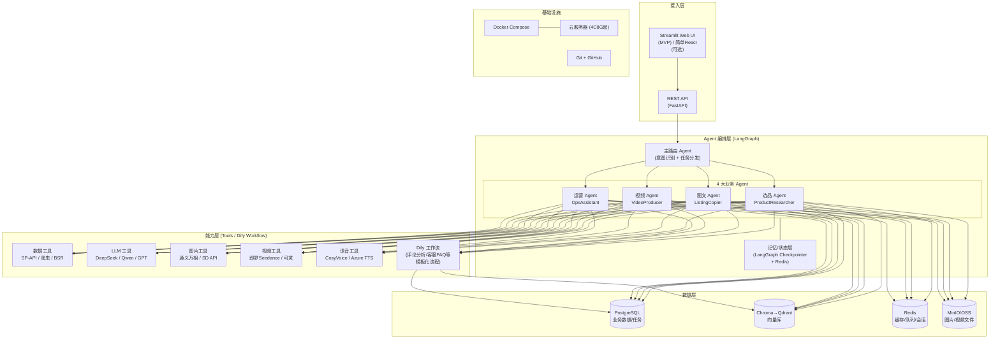

# 跨境电商AI全链路助手 —— 完整项目方案

> **项目目标**：用一个打通"选品→图文→视频→运营"的AI应用，作为求职AI应用工程师（1-3年经验段，成都 8-25k 区间）的核心作品集项目。
> **开发周期**：24周（6个月），在职，工作日每晚 3h + 周末 8h，合计约 **168h/月 × 6 ≈ 1000h**。
> **开发方式**：Python 为主 + Cursor/Copilot AI 辅助编码，低代码（Dify）承担非核心编排，手写代码聚焦 Agent/RAG/业务逻辑。
> **设计原则**：**业务懂行者做AI**——不卷模型层、不卷算法，卷"懂跨境业务的AI工程化落地"。

---

## 一、系统架构

### 1.1 整体分层架构（Mermaid）



### 1.2 核心数据流

```
用户在 Streamlit 输入任务（例："帮我分析 AirTag 保护壳这个类目"）
  → API 接收 → LangGraph 主路由 Agent 做意图识别 + 任务拆解
  → 路由到「选品 Agent」
     → Agent 调用 Tool：拉取 BSR Top100、竞品详情、评论（SP-API/爬虫）
     → Tool 返回结构化数据 → 写入 PostgreSQL + 向量化入 Chroma
     → Agent 编排 Prompt → 调用 DeepSeek → 输出利基分析报告
  → 结果回写 PostgreSQL + MinIO（报告/PDF）
  → Streamlit 渲染报告 + 图表
```

通用链路：**用户输入 → 路由 Agent（LLM 判断意图）→ 业务 Agent（规划+调Tool）→ Tool 执行（API/爬虫/DB）→ LLM 生成 → 持久化 → 前端渲染**。

### 1.3 多 Agent 协作设计

| Agent | 职责 | 输入 | 输出 | 关键能力 |
|-------|------|------|------|----------|
| **主路由 Agent** | 意图识别、任务拆解、失败重试、人工确认节点 | 用户自然语言 | 路由结果 + 子任务 | ReAct + Function Calling + 状态机 |
| **选品 Agent** | 类目调研、竞品分析、评论挖掘、趋势判断 | 关键词/ASIN | 选品报告（利基/容量/竞争度） | Tool Use（SP-API/爬虫）+ RAG（历史选品库） |
| **图文 Agent** | Listing 文案、A+ 文案、Search Terms、产品图 | ASIN / 产品信息 | 标题/五点/A+文案 + 主图/场景图 | 模板化 Prompt + 多模态图生图 |
| **视频 Agent** | 脚本分镜、视频生成、配音、字幕、合成 | 产品图 + 卖点 | 15-30s 短视频（MP4） | 脚本LLM + 视频API + FFmpeg剪辑 |
| **运营 Agent** | 评论情感分析、广告文案、客服回复、数据看板 | 评论/订单/广告数据 | 分析报告 + 回复草稿 | RAG（FAQ/政策库）+ Dify 工作流 |

**协作模式**：主路由 Agent 通过 LangGraph 的 `StateGraph` 维护全局状态（产品ID、任务进度、历史产出），各 Agent 之间通过"共享产品上下文"串联——例如选品 Agent 锁定 ASIN 后，图文 Agent 直接消费同一份结构化产品数据，无需用户重复输入。

**为什么用 LangGraph 而不是纯 LangChain**：岗位 JD 中 LangGraph 提及率 40%，且选品→图文→视频是**有状态的多步工作流**（含人工确认节点、失败重试、循环），LangGraph 的状态机模型天然适合。

### 1.4 低代码 vs 手写代码 边界

| 部分 | 实现方式 | 理由 |
|------|----------|------|
| 主路由 + 4大业务 Agent 的编排逻辑 | **手写 LangGraph** | 这是项目核心，面试要讲清楚状态机/工具调用/记忆机制 |
| RAG 知识库（跨境政策/FAQ/选品方法论） | **手写 LangChain** + Chroma | 岗位 JD 80% 要求 RAG，必须手写体现深度 |
| 评论情感分析（批量、模板化） | **Dify 工作流** | 模板固定，用 Dify 拖拽快，且简历能写"Dify" |
| 客服 FAQ 自动回复 | **Dify + RAG** | 同上，标准问答场景 |
| 数据采集（SP-API/爬虫） | **手写 Python** | 需要处理反爬、限流、数据清洗 |
| 视频生成流水线（脚本→生成→配音→字幕→合成） | **手写 Python 编排** | 多步骤异步、需要 FFmpeg、需要失败重试 |
| 前端 | **Streamlit** | 一个人做不完 React，Streamlit 在 JD 里也被点名 |

**边界原则**：**凡是面试要被追问"为什么这么设计"的核心链路，手写；凡是模板化、一次性的流程，用 Dify 快速搭**。这样简历上既有 LangChain/LangGraph（深度），又有 Dify（工程效率）。

---

## 二、完整技术栈（精确到工具/版本）

### 2.1 基础语言与框架

| 类别 | 选型 | 版本 | 用途 |
|------|------|------|------|
| 主语言 | Python | **3.11.x**（不选3.12，生态兼容最稳） | 全部后端/Agent/脚本 |
| LLM 框架 | LangChain | **0.2.x**（`langchain` + `langchain-core` + `langchain-community`） | Prompt模板、Tool抽象、Chain |
| Agent 编排 | LangGraph | **0.1.x** | StateGraph、Agent状态机、人工节点 |
| LLM 调用抽象 | LangChain OpenAI 兼容接口 | — | 统一对接 DeepSeek/Qwen（二者均兼容OpenAI协议） |
| Web 后端 | FastAPI | **0.110.x** | REST API + WebSocket（视频任务进度推送） |
| 异步 | asyncio + aiohttp | — | 视频/图片生成是长耗时任务，必须异步 |
| 前端 MVP | Streamlit | **1.34.x** | 快速搭 UI，JD 里直接点名 |
| 前端（可选升级） | React + Vite + shadcn/ui | — | **非必要**，仅当时间充裕才做，MVP 阶段用 Streamlit |

### 2.2 LLM / 多模态模型 API

| 用途 | 主选 | 备选 | 选型理由 |
|------|------|------|----------|
| 文案/选品分析/脚本 | **DeepSeek-V3 (deepseek-chat)** | Qwen-Max / GPT-4o-mini | 中文好、价格≈¥1/百万token、电商场景足够 |
| 复杂推理（选品决策） | **DeepSeek-R1** | o1-mini | 思维链强，用于"为什么选这个品"的论证 |
| 多模态（读评论截图/产品图） | **Qwen-VL-Max** | GPT-4o | 国产、便宜、能读图 |
| Function Calling | DeepSeek / Qwen | — | 二者都支持 tool_calls |

**成本控制**：开发期用 DeepSeek（成本极低），仅在演示/demo 片段调用 GPT-4o 做对比展示。

### 2.3 图文生成

| 用途 | 选型 | 说明 |
|------|------|------|
| 产品主图/场景图（快速） | **通义万相 wanx2.1-image** | 国内 API、电商场景优化、价格≈¥0.2/张、支持中文Prompt，适合批量快速出图 |
| 产品主图/场景图（高质量/可控） | **ComfyUI + Stable Diffusion** | 本地节点式工作流，支持ControlNet/LoRA/批量生成，适合需要精细控制的场景；无N卡可用云GPU（AutoDL/阿里云，约¥1-2/小时） |
| 图生图（保留产品主体换背景） | 通义万相 image-to-image + **ComfyUI ControlNet** | 竞品图→改背景/换场景；ComfyUI用ControlNet深度图/线稿控制保持主体 |
| 备选高质量图 | Stable Diffusion XL (ComfyUI内) | 本地部署省成本，但MVP期直接调API |
| 不选 DALL-E 的理由 | — | 贵（$0.08/张起）、国内调用麻烦、电商主图合规性不如国产模型 |

**双方案策略**：通义万相API用于快速批量出图（开发期和日常使用），ComfyUI用于高质量/可控场景（面试展示技术深度）。简历上写"多模态图文生成：通义万相API + ComfyUI工作流（ControlNet/LoRA）"，覆盖两种技术路线。

### 2.4 视频生成（核心决策）

| 方案 | 单秒成本 | 易用性 | 电商效果 | 结论 |
|------|----------|--------|----------|------|
| **即梦 Seedance (字节)** | ≈¥0.5-1/秒 | ★★★★★ 国内API直连、中文Prompt | 产品展示/场景视频好 | **主选** |
| 可灵 AI (快手) | ≈¥1-2/秒 | ★★★★ | 人物动作更自然 | **备选/对比** |
| Runway Gen-3 | ≈$0.5/秒 | ★★★ 需魔法、英文Prompt | 质量最高但贵 | **仅做1条demo对比** |

**最终选型结论：即梦 Seedance API 为主，可灵为备选，Runway 只在面试演示时跑 1 条 10s 高质量片段作为"技术深度展示"。**

**为什么不本地部署视频模型**：CogVideo/HunyuanVideo 本地部署需要 24G+ 显存，个人项目不现实；API 调用成本可控（一条 15s 视频 ≈ ¥10-15），且面试讲"我评估过自建 vs API，基于成本/效果/迭代速度选了API"是加分项。

### 2.5 语音与剪辑

| 用途 | 选型 | 说明 |
|------|------|------|
| 配音 TTS | **CosyVoice 2 (阿里开源)** | 本地部署免费、支持中英双语、情感自然；备选 Azure TTS（¥15/百万字符） |
| 字幕 | **Whisper large-v3 (本地)** 或 faster-whisper | 自动识别配音音频生成字幕SRT |
| 视频剪辑合成 | **FFmpeg (命令行)** + **MoviePy (Python封装)** | 拼接视频片段、加字幕、加BGM、转场 |
| BGM | 商用免费素材库 | 避免版权问题 |

### 2.6 数据采集

| 用途 | 选型 | 说明 |
|------|------|------|
| 专业选品数据 | **卖家精灵（SellerSprite）** | 跨境电商专业选品工具，提供BSR排名/销量估算/趋势分析/竞品监控；支持CSV导出，部分功能有API；**作为选品模块核心数据源** |
| 官方数据 | **Amazon SP-API**（Selling Partner API） | 需注册开发者+卖家账号；MVP可先用测试账号/沙箱 |
| 评论/BSR补充 | **requests + BeautifulSoup / Playwright** | 反爬处理：代理IP池 + 随机UA + 限速；明确标注仅用于学习 |
| 备选数据源 | Keepa API / 卖家精灵导出CSV | 个人项目可直接用现成CSV做演示，不必硬刚反爬 |
| 解析 | parsel / lxml | HTML解析 |

**数据优先级**：卖家精灵（专业、稳定）> SP-API（官方、需资质）> 爬虫（补充、易被封）。MVP阶段以卖家精灵CSV导出为主，爬虫作为能力点展示。

**务实建议**：MVP阶段**不要把大量时间耗在爬虫反爬上**——用卖家精灵导出20-50个ASIN的样本数据 + SP-API沙箱数据即可跑通流程；爬虫作为"能力点"写在简历，代码里做一个Playwright示例即可。

### 2.7 数据存储

| 组件 | 选型 | 用途 |
|------|------|------|
| 关系库 | **PostgreSQL 16** | 产品、任务、订单、用户、生成记录 |
| 向量库 | **Chroma（MVP）→ Qdrant（生产化阶段）** | RAG 知识库（政策/FAQ/历史选品方法论） |
| 缓存/队列 | **Redis 7** | 会话状态、任务队列（Celery/RQ）、热点数据缓存 |
| 对象存储 | **MinIO（本地）→ 阿里云OSS（生产）** | 图片、视频、报告PDF |
| 任务队列 | **Celery + Redis** 或 RQ | 视频生成是长任务，必须异步 |

### 2.8 部署与工程化

| 类别 | 选型 |
|------|------|
| 容器化 | **Docker + Docker Compose**（FastAPI / PostgreSQL / Redis / MinIO / Chroma / Streamlit / Celery Worker 一键起） |
| 容器生产化 | 健康检查（healthcheck）、重启策略（restart: unless-stopped）、资源限制（mem_limit/cpus）、日志驱动（json-file max-size）、secrets管理（.env不入库） |
| 反向代理 | **Nginx**：反向代理到FastAPI/Streamlit，负载均衡，静态资源缓存 |
| HTTPS | **Let's Encrypt + Certbot**：免费SSL证书，自动续期 |
| 进程管理 | **systemd**：Docker服务自启动，Nginx自启动，崩溃自动重启 |
| 日志管理 | 日志轮转（logrotate），Docker日志限制，应用日志按日期分割 |
| 监控 | 简单监控脚本：磁盘空间/内存/CPU/服务存活检查，异常告警（邮件/钉钉） |
| 云服务器 | 阿里云/腾讯云 **4C8G 5M带宽**（约¥150/月），Ubuntu 22.04 LTS |
| 代码管理 | Git + GitHub（README 写清楚架构图 + 启动方式 + demo GIF + 部署文档） |
| Git工作流 | **每日commit**：feature分支开发 → 合并main → 打tag版本；模拟真实团队开发流程 |
| CI（可选） | GitHub Actions：lint + 自动构建镜像 |
| 监控（轻量） | LangSmith（LangChain官方，免费层够用，追踪LLM调用链——面试加分项） |

### 2.9 Linux开发环境与运维规范

**开发环境**：
- 本地用 **WSL2 (Ubuntu 22.04)** 作为开发环境，模拟Linux服务器
- 所有代码在WSL2中编写和运行，Windows只做编辑器和浏览器
- 每天在WSL2终端中完成：git操作、Docker命令、Python运行

**运维规范（从第1周开始养成习惯）**：
1. **每日commit**：每天结束前 `git add . && git commit -m "feat: xxx" && git push`，commit message遵循Conventional Commits规范
2. **环境隔离**：开发用Docker Compose本地，生产用云服务器，配置通过环境变量区分
3. **密钥管理**：`.env`文件不入库，用`.env.example`做模板，真实密钥本地保存
4. **日志规范**：应用用`loguru`按日期分割日志，Docker日志限制max-size=10m
5. **服务自启动**：生产环境所有服务通过systemd管理，开机自启，崩溃重启
6. **备份策略**：PostgreSQL每日自动备份到MinIO/OSS，保留7天

### 2.10 AI 编码工具链（核心开发方式）

| 工具 | 用法 |
|------|------|
| **Cursor** | 主力编辑器；用 Composer/Agent 模式生成模块骨架、写 FastAPI 接口、写 SQL、写 Dify API 调用 |
| **GitHub Copilot** | 辅助补全；Cursor 不可用时的备选 |
| **Cursor 高效开发要点** | ① 先写清楚模块的输入输出契约（dataclass/Pydantic模型）再让它生成；② 一次只让它写一个函数/一个文件；③ 报错时把完整 stack trace 贴给它；④ 用 `.cursorrules` 固化项目规范（Python风格、错误处理、日志格式） |

### 2.11 前端技术栈与学习路径

> **岗位现状**：AI应用工程师岗位中，约40%要求"全栈"或"前端基础"，但中小公司通常不要求精通React/Vue，更看重"能快速出可交互Demo"。

| 层级 | 技术 | 学习深度 | 用途 | 优先级 |
|------|------|----------|------|--------|
| **P0 主力** | Streamlit | 熟练：多页面/表单/表格/Plotly图表/状态管理/文件上传 | MVP快速出Demo，JD直接点名 | 必学 |
| **P0 基础** | HTML + CSS + JavaScript | 能看懂、能改简单页面；理解DOM、事件、fetch调API | 调试前端问题、改简单页面 | 必学 |
| **P1 接口联调** | FastAPI + 原生前端 | 用fetch/axios调后端API，处理JSON响应，渲染页面 | 脱离Streamlit做独立前端 | 重要 |
| **P1 图表** | ECharts 或 Plotly.js | 能画折线图/柱状图/饼图，数据可视化 | 运营数据看板 | 重要 |
| **P2 进阶** | React + Vite | 基础：组件/props/state/useEffect/路由 | 简历加分，时间充裕再学 | 选学 |
| **P2 样式** | Tailwind CSS | 能快速写样式，不用记CSS | 配合React | 选学 |

**前端学习策略**：
- **前12周**：只用Streamlit，不碰原生前端，集中精力做后端和AI核心
- **第13-18周**：视频模块需要进度条和实时状态，学一点JavaScript（fetch + DOM操作）
- **第19-24周**：如果时间充裕，用React重写首页作为"全栈能力"展示；时间不够就Streamlit到底
- **面试表达**："前端我主要用Streamlit快速出Demo，同时熟悉HTML/CSS/JS基础，能做前后端联调，React了解基础"

---

## 三、工程化能力补强（6项面试高频技能）

> **背景**：对照100个岗位JD，项目已覆盖80%核心技能，但以下6项是"区分会调API和能做生产级应用"的关键，面试高频追问，必须补进项目。

### 3.6.1 Function Calling / 工具调用

**是什么**：让LLM不只是聊天，而是能自主决定调用外部函数/API（查销量、算价格、发邮件），是Agent的核心机制。

**岗位要求**：80%的Agent相关岗位要求，面试必问"你项目里Agent怎么调工具的？"

**项目落点**：
- 选品Agent：定义`@tool`装饰的工具函数
  - `search_seller_sprite(keyword)` → 调卖家精灵API查BSR/销量
  - `fetch_competitor_detail(asin)` → 抓竞品详情
  - `get_reviews(asin, limit)` → 拉取评论
  - `calculate_profit(price, cost, fee)` → 算利润
- LangGraph Agent通过`bind_tools()`绑定工具，LLM自主决定调哪个
- 工具返回结构化数据 → Agent继续推理 → 生成报告

**代码示例（核心片段）**：
```python
from langchain_core.tools import tool
from langchain_deepseek import ChatDeepSeek

@tool
def search_seller_sprite(keyword: str) -> dict:
    """查询卖家精灵竞品数据，返回BSR排名、销量估算、趋势"""
    # 调用卖家精灵API
    return {"bsr": 1234, "monthly_sales": 500, "trend": "up"}

@tool
def calculate_profit(price: float, cost: float, fee_rate: float = 0.15) -> float:
    """计算单品利润：售价 - 成本 - 平台费"""
    return price - cost - price * fee_rate

tools = [search_seller_sprite, calculate_profit]
llm = ChatDeepSeek(model="deepseek-chat").bind_tools(tools)

# Agent循环：LLM决定调工具 → 执行工具 → 结果返回LLM → 继续推理
```

**面试话术**："我项目里选品Agent用LangChain的Function Calling，定义了4个工具（卖家精灵查数据、抓竞品、拉评论、算利润），LLM自主决定调哪个，工具返回结构化数据后Agent继续推理生成报告。这比单纯Prompt调用API灵活，因为Agent能根据中间结果决定下一步。"

---

### 3.6.2 流式输出（Streaming / SSE）

**是什么**：LLM生成内容时逐字/逐句返回，不是等全部生成完再显示，用户体验的关键。

**岗位要求**：约50%岗位要求，用户体验相关面试常问"你们AI回复是流式的吗？怎么实现的？"

**项目落点**：
- FastAPI加SSE（Server-Sent Events）接口：`/api/generate/stream`
- 用`StreamingResponse` + `event_source_response`
- 前端用EventSource接收，逐字渲染
- 选品报告、Listing文案、视频脚本生成都支持流式

**代码示例**：
```python
from fastapi import FastAPI
from fastapi.responses import StreamingResponse
import asyncio

app = FastAPI()

@app.post("/api/generate-listing/stream")
async def generate_listing_stream(product: ProductInfo):
    async def event_generator():
        # LLM流式生成
        async for chunk in llm.astream(prompt):
            yield f"data: {chunk.content}\n\n"
        yield "data: [DONE]\n\n"
    return StreamingResponse(event_generator(), media_type="text/event-stream")
```

**前端接收**：
```javascript
const evtSource = new EventSource('/api/generate-listing/stream');
evtSource.onmessage = (e) => {
    if (e.data === '[DONE]') { evtSource.close(); return; }
    outputDiv.textContent += e.data;  // 逐字追加
};
```

---

### 3.6.3 评估与可观测性（Evaluation + Observability）

**是什么**：
- **评估**：怎么量化LLM输出好不好？RAG检索准不准？
- **可观测性**：每次LLM调用花了多少token？耗时多久？哪次调用失败了？

**岗位要求**：生产环境必备，面试常问"你怎么评估RAG效果？""怎么监控LLM调用成本？"

**项目落点**：
- **LangSmith接入**（已在技术栈中，深化使用）：
  - 记录每次LLM调用的prompt/response/token数/耗时/错误
  - 给关键链路打tag（选品/图文/视频）
  - 用LangSmith的Evaluation功能跑自动化测试集
- **RAG评估**：
  - 建20个标准问题+标准答案的测试集
  - 指标：检索命中率（retrieval precision）、答案相关性（relevance）、幻觉率
  - 每次改Prompt/切分策略后跑评估，用数据说话
- **成本仪表盘**：
  - 数据库存每次调用的model/prompt_tokens/completion_tokens/cost
  - Streamlit页面展示日/月成本趋势、各模块成本占比

**面试话术**："我用LangSmith做LLM调用链追踪，能看到每次调用的token消耗和耗时。RAG效果我建了20个标准问题的测试集，评估检索命中率和答案相关性，调chunk_size从256到512后准确率从72%提到80%。"

---

### 3.6.4 多模型路由与降级

**是什么**：不同任务用不同模型（简单任务用便宜模型，复杂任务用好模型），模型挂了自动切备用。

**岗位要求**：约30%岗位提及，体现"模型选型能力"和"系统稳定性思维"

**项目落点**：
- 写`ModelRouter`类，根据任务类型选模型：
  - 文案生成/翻译 → DeepSeek-V3（便宜，¥1/百万token）
  - 选品决策/复杂推理 → DeepSeek-R1（推理强）
  - 图片审核 → Qwen-VL-Max（多模态）
  - 图片生成 → 通义万相
  - 视频生成 → 即梦Seedance（主）→ 可灵（备）
- 降级机制：try-catch捕获API异常，自动切换备用模型
- 配置文件管理模型优先级，不用改代码

**代码示例**：
```python
class ModelRouter:
    def __init__(self):
        self.models = {
            "copywriting": ["deepseek-chat", "qwen-max"],
            "reasoning": ["deepseek-reasoner", "gpt-4o-mini"],
            "vision": ["qwen-vl-max", "gpt-4o"],
        }
    
    async def chat(self, task_type: str, messages: list):
        for model in self.models[task_type]:
            try:
                llm = ChatDeepSeek(model=model) if "deepseek" in model else ChatQwen(model=model)
                return await llm.ainvoke(messages)
            except Exception as e:
                logger.warning(f"模型{model}失败，切换下一个: {e}")
                continue
        raise RuntimeError("所有模型都失败了")
```

---

### 3.6.5 异步任务队列

**是什么**：视频生成、批量选品这种耗时任务（几分钟），后台异步执行，前端轮询/WebSocket推送进度。

**岗位要求**：约35%岗位要求异步编程，视频/批量处理场景必备

**项目落点**：
- Celery + Redis做任务队列（已在技术栈中，深化）
- 任务状态机：PENDING → RUNNING → SUCCESS / FAILED
- 前端WebSocket实时推送进度（百分比+当前步骤）
- 任务记录表存PostgreSQL，支持历史查询和重试
- 视频生成、批量选品、批量图片生成都走异步队列

**面试话术**："视频生成可能要3-5分钟，不能让用户干等。我用Celery+Redis做异步任务队列，提交任务后立即返回task_id，前端通过WebSocket接收进度推送（'正在生成第2个片段...'），任务状态存在PostgreSQL支持历史查询和失败重试。"

---

### 3.6.6 Token成本计算与控制

**是什么**：每次LLM调用花了多少钱？怎么限制用量？怎么优化成本？

**岗位要求**：老板最关心成本，面试常问"你们怎么控制LLM调用成本？"

**项目落点**：
- 封装`LLMClient`，每次调用自动记录：
  - model, prompt_tokens, completion_tokens, total_tokens
  - 按模型单价计算cost（DeepSeek ¥1/百万input，¥2/百万output）
  - 存入`generation_records`表
- 成本控制：
  - 上下文窗口管理：自动截断过长的历史对话
  - 缓存：相同prompt的结果缓存（Redis），避免重复调用
  - 批量处理：多条评论合并成一次调用（降低调用次数）
  - 模型路由：简单任务用便宜模型
- 成本仪表盘：日/月成本趋势、各模块占比、单次任务平均成本

**面试话术**："我封装了LLMClient，每次调用自动记录token和成本存数据库。成本控制做了四点：①上下文自动截断避免超长；②相同prompt结果缓存到Redis；③批量评论合并一次调用；④简单任务用DeepSeek便宜模型。一个选品报告成本约¥0.05，一条视频脚本约¥0.02。"

---

## 三、模块拆分与功能点

### 3.1 选品模块

| # | 功能点 | 实现方式 | 代码量 | 对应JD技能点 | 难度 |
|---|--------|----------|--------|--------------|------|
| 1 | **卖家精灵数据接入**：导出/API获取BSR排名、销量估算、趋势分析 | 卖家精灵CSV解析 + API对接 | 300行 | 数据接入、API对接 | 低 |
| 2 | 输入关键词，拉取亚马逊BSR Top类目榜 | SP-API / 爬虫 | 250行 | Python异步、API对接 | 中 |
| 3 | 输入ASIN，抓取竞品详情（标题/价格/评分/评论数） | Playwright + 解析 | 350行 | 爬虫、数据清洗 | 中 |
| 4 | 批量拉取竞品评论（Top 100） | SP-API/爬虫 | 250行 | 数据处理 | 中 |
| 5 | 评论聚类与痛点挖掘（LLM分析高频差评） | DeepSeek + Prompt模板 | 300行 | Prompt Engineering、LLM应用 | 中 |
| 6 | 利基市场判断（竞争度/市场容量/进入门槛） | LangGraph Agent + Tool Use | 500行 | Agent、Function Calling、推理 | 高 |
| 7 | 历史选品知识库 RAG（沉淀过往成功案例） | LangChain + Chroma | 400行 | RAG、向量库、Embedding | 中 |
| 8 | 选品报告生成（结构化Markdown/PDF，含卖家精灵数据图表） | LLM + Jinja2模板 + Plotly | 250行 | 文档生成、数据可视化 | 低 |

**小计：≈2600 行**

### 3.2 图文生成模块

| # | 功能点 | 实现方式 | 代码量 | 对应JD技能点 | 难度 |
|---|--------|----------|--------|--------------|------|
| 1 | Listing标题生成（埋关键词、符合亚马逊字符规则） | DeepSeek + Few-Shot模板 | 200行 | Prompt Engineering | 低 |
| 2 | 五点描述（Five Bullet Points）生成 | LLM + 卖点结构化 | 200行 | LLM应用 | 低 |
| 3 | A+页面文案 + Search Terms 生成 | LLM | 150行 | — | 低 |
| 4 | 多语言版本（英/德/日）一键生成 | LLM翻译 + 本地化Prompt | 150行 | 多模态/多语言 | 低 |
| 5 | 产品主图生成/修复（白底主图）- API方案 | 通义万相 API | 200行 | 多模态API | 中 |
| 6 | 场景图/生活方式图生成（图生图换背景）- API方案 | 通义万相 image-to-image | 250行 | 多模态 | 中 |
| 7 | **ComfyUI工作流**：文生图/图生图/ControlNet保持主体 | ComfyUI + SD + ControlNet | 300行(配置+API调用) | ComfyUI、ControlNet、工作流 | 中高 |
| 8 | **ComfyUI批量生成**：一次出10张场景图，LoRA风格控制 | ComfyUI API + 批量调度 | 200行 | 批量处理、LoRA | 中 |
| 9 | A+ 图文混排生成（文案+配图自动匹配） | LLM + 图片API编排 | 350行 | Agent编排 | 中高 |
| 10 | 图片合规检查（亚马逊主图规则：白底/无文字/无水印） | Qwen-VL 多模态审核 | 200行 | 多模态审核 | 中 |

**小计：≈2200 行**（含ComfyUI工作流配置和API调用）

### 3.3 视频生成模块

| # | 功能点 | 实现方式 | 代码量 | 对应JD技能点 | 难度 |
|---|--------|----------|--------|--------------|------|
| 1 | 短视频脚本生成（15s/30s TikTok风格分镜） | DeepSeek + 分镜模板 | 300行 | LLM应用、Prompt | 中 |
| 2 | 分镜→视频片段调用即梦Seedance API | 手写异步调用 | 400行 | 异步编程、API集成 | 中高 |
| 3 | 配音生成（英文/口音） | CosyVoice 调用 | 250行 | TTS、多模态 | 中 |
| 4 | 自动字幕生成 + 烧录 | faster-whisper + FFmpeg | 300行 | ASR、FFmpeg | 中 |
| 5 | 视频片段拼接 + BGM + 转场 | FFmpeg / MoviePy | 350行 | 音视频处理 | 中高 |
| 6 | 任务队列（视频生成耗时长，异步轮询） | Celery + Redis | 300行 | 异步任务、工程化 | 中 |
| 7 | 失败重试 / 降级（Seedance失败→切可灵） | 手写降级逻辑 | 150行 | 容错设计 | 中 |

**小计：≈2050 行**

### 3.4 运营模块

| # | 功能点 | 实现方式 | 代码量 | 对应JD技能点 | 难度 |
|---|--------|----------|--------|--------------|------|
| 1 | 评论情感分析 + 差评预警（批量） | Dify 工作流 | 150行（配置为主） | Dify、LLM | 低 |
| 2 | 差评自动回复草稿生成 | LLM + 品牌语气模板 | 200行 | Prompt | 低 |
| 3 | 广告文案生成（SP/SD广告标题） | LLM + 模板 | 150行 | — | 低 |
| 4 | 客服自动回复（FAQ RAG） | Dify + RAG | 200行 | RAG、Dify | 中 |
| 5 | 运营数据看板（销量/评分/转化趋势） | Streamlit + Plotly | 350行 | 数据可视化 | 中 |
| 6 | 主路由 Agent（串联4大模块） | LangGraph StateGraph | 500行 | Agent、状态机 | 高 |
| 7 | 用户认证 + 任务记录 | FastAPI + JWT | 300行 | 后端工程化 | 中 |

**小计：≈1850 行**

### 3.5 基础设施与胶水代码

| 类别 | 代码量 |
|------|--------|
| FastAPI 路由/中间件/异常处理 | 600行 |
| PostgreSQL 模型 (SQLAlchemy) + 迁移 (Alembic) | 500行 |
| MinIO/OSS 文件存取封装 | 200行 |
| Dockerfile + docker-compose.yml + .env 管理 | 200行 |
| 日志/配置/工具函数 | 300行 |
| Streamlit 页面（约8-10个页面） | 800行 |
| LangSmith 追踪接入 | 100行 |
| README + 架构文档 | —（Markdown） |

**小计：≈2700 行**

---

## 四、代码量估算汇总

| 模块 | 代码量 |
|------|--------|
| 选品模块（含卖家精灵接入） | ~2,600 行 |
| 图文生成模块（含ComfyUI工作流） | ~2,200 行 |
| 视频生成模块 | ~2,050 行 |
| 运营模块 | ~1,850 行 |
| 基础设施/胶水/前端（含Docker/Linux运维） | ~2,900 行 |
| **总计** | **≈ 11,600 行**（落在 10,000-15,000 区间内） |

> 注：以上为手写 Python 代码量，**不含** Dify 配置、ComfyUI工作流JSON、Prompt 文本（Prompt 单独存为 YAML/MD，约 100 个模板）、前端 HTML/CSS、SQL。

### 哪些能靠 AI 工具快速生成，哪些要手动调

| 可靠 Cursor 快速生成（占 ~70%） | 必须手动调试（占 ~30%） |
|----------------------------------|--------------------------|
| FastAPI 路由骨架、Pydantic 模型 | LangGraph 状态机的节点跳转/条件分支 |
| SQLAlchemy 模型、CRUD | 视频 API 的异步轮询 + 失败重试逻辑 |
| Streamlit 页面布局 | 爬虫反爬策略、请求头、限速 |
| Prompt 模板初稿 | FFmpeg 参数（字幕烧录、分辨率、码率） |
| Dockerfile / docker-compose | 多 Agent 间的上下文传递与记忆管理 |
| 单元测试模板 | 多模态图片生成的合规性微调 |
| 数据清洗脚本 | Prompt 调优（这是你的业务优势，必须自己写） |

**关键认知**：AI 生成的代码 80% 能跑，但真正值钱的 20%——**业务逻辑编排、Prompt 设计、异常处理、成本控制**——必须你自己懂。这恰好和你"懂跨境业务"的优势互补。

---

## 五、分阶段实现路线（24周）

### Phase 1：MVP 核心链路（Week 1-6，约 6 周）

**目标**：跑通"关键词→选品报告"最小闭环 + RAG 知识库。

| 周 | 任务 |
|----|------|
| W1 | 项目脚手架：Python 3.11 + Poetry + FastAPI + Docker Compose 起 PostgreSQL/Redis/MinIO/Chroma；写 `.cursorrules` |
| W2 | LangChain + LangGraph 入门：手写一个最简单的 ReAct Agent；接入 DeepSeek API；LangSmith 接入 |
| W3 | 选品数据采集：用 SP-API 沙箱或导入 20 个样本 ASIN 的 CSV；写竞品详情抓取 |
| W4 | 评论抓取 + LLM 痛点分析（差评聚类） |
| W5 | 选品 Agent：LangGraph StateGraph 编排"调研→分析→报告"；RAG 知识库（跨境政策/选品方法论） |
| W6 | Streamlit 首页 + 选品报告展示页；**Phase 1 Demo：输入关键词→输出一份选品分析报告** |

**本阶段产出**：可演示 Demo 1 个；代码 ~3,000 行；简历可写：Python/FastAPI/LangChain/LangGraph/RAG/Chroma/Dify(初步)。

### Phase 2：图文生成模块（Week 7-12，约 6 周）

| 周 | 任务 |
|----|------|
| W7 | Listing 文案三件套：标题/五点/A+ + Few-Shot 模板；多语言版本 |
| W8 | 通义万相 API 接入：主图生成、图生图换背景 |
| W9 | 多模态审核：Qwen-VL 做亚马逊主图合规检查 |
| W10 | A+ 图文混排 Agent：文案+配图自动编排 |
| W11 | 图文模块前端页面；与选品模块串联（选好品一键生成Listing） |
| W12 | 打磨 Prompt 库；沉淀 30+ 行业模板；**Phase 2 Demo：从ASIN到完整Listing文案+5张图** |

**本阶段产出**：Demo 2 个；累计代码 ~5,500 行。

### Phase 3：视频生成模块（Week 13-18，约 6 周）

| 周 | 任务 |
|----|------|
| W13 | 脚本生成：分镜模板 + TikTok/亚马逊风格 Prompt |
| W14 | 即梦 Seedance API 接入：分镜→视频片段；Celery 异步任务队列 |
| W15 | CosyVoice 配音 + faster-whisper 字幕 |
| W16 | FFmpeg 合成：片段拼接+BGM+字幕烧录+转场 |
| W17 | 降级逻辑：Seedance 失败→可灵；参数调优（分辨率/时长/成本控制） |
| W18 | 视频模块前端；**Phase 3 Demo：上传产品图→自动产出 15s 带字幕配音短视频** |

**本阶段产出**：Demo 3 个（含视频成片）；累计代码 ~8,000 行。

### Phase 4：运营模块 + 全栈整合 + 部署（Week 19-24，约 6 周）

| 周 | 任务 |
|----|------|
| W19 | Dify 搭建：评论情感分析工作流、客服FAQ RAG |
| W20 | 运营 Agent：差评回复草稿、广告文案生成 |
| W21 | 数据看板：Streamlit + Plotly 做销量/评分/转化趋势 |
| W22 | 主路由 Agent 整合四大模块；用户认证；任务记录 |
| W23 | 云服务器部署：Docker Compose 上云；OSS 切换；域名/HTTPS |
| W24 | 收尾：GitHub README（架构图+Demo GIF+启动文档）、录制 3 分钟项目讲解视频、简历话术打磨 |

**本阶段产出**：完整可在线访问的产品 Demo + GitHub 开源仓库；累计代码 ~10,750 行。

---

## 六、风险与降级方案

### 6.1 视频模块风险

| 风险 | 降级方案 |
|------|----------|
| Seedance API 成本超预算 | ① 把视频片段时长压到 5s/段；② 开发期用静态图+Ken Burns 效果（缩放平移）模拟视频；③ 只在最终 demo 阶段调用真实视频API |
| 视频效果不稳定/不符合电商预期 | ① 降级为"图片轮播视频"（FFmpeg 把多张场景图拼成视频+配音），**这在面试里讲成"我做了成本/效果权衡"反而是加分项**；② 保留"AI视频生成"模块的完整代码路径，只是默认走图片轮播 |
| 视频 API 限流/停服 | 代码里抽象 `VideoGenerator` 接口，Seedance/可灵/图片轮播三选一，配置切换 |

### 6.2 各模块最低可接受版本

| 模块 | 完整版 | 最低可接受版本（时间不够时） |
|------|--------|------------------------------|
| 选品 | Agent自动调研+RAG | **固定流程脚本**：输入ASIN→抓评论→LLM分析（不用LangGraph，用Chain） |
| 图文 | 多模态审核+A+编排 | **Listing文案生成**（标题/五点/A+）+ 调通1个图片API |
| 视频 | 全自动脚本→成片 | **脚本生成 + 调用1次视频API出1条样片**（不做自动合成） |
| 运营 | Dify工作流+看板 | **评论情感分析**一个功能点即可 |
| 架构 | 多Agent+云部署 | **Streamlit单文件 + SQLite**（能跑通就算MVP） |

**底线**：即使最后只交出"选品+Listing文案"两个模块 + RAG，也已经覆盖了 JD 里 Python/LangChain/RAG/Prompt/FastAPI 五大核心技能点，足够过简历关。

### 6.3 AI 辅助编码最佳实践（Cursor 用法）

1. **先写契约，再让Cursor写实现**：先用 Pydantic 定义清楚输入输出模型，再让它写函数体，避免它瞎编接口。
2. **一次一个文件**：不要说"帮我写完整个选品模块"，要说"按这个接口契约写 `product_researcher.py`"。
3. **把报错原文贴全**：stack trace 完整复制，不要手动概括。
4. **用 `.cursorrules` 固化规范**：Python 风格（ruff）、错误处理用自定义异常、日志用 `loguru`、配置走 pydantic-settings。
5. **先让它写测试**：让 Cursor 先写 pytest 用例，再写实现——既能验证代码，又能补简历"会写测试"。
6. **业务逻辑自己盯**：Prompt 模板、亚马逊合规规则、选品判断逻辑，这些 Cursor 不懂，你必须自己写并 review。
7. **每天 commit**：Cursor 改坏了能回滚，也是面试讲 Git 工作流的素材。

---

## 七、项目差异化卖点与面试表达

### 7.1 和普通 AI 项目的区别

| 普通AI项目 | 本项目 |
|------------|--------|
| 套壳 ChatGPT（一个聊天框） | **多Agent编排**：4个Agent + 主路由 + 状态机 + 人工节点 |
| 单功能demo（仅RAG或仅Agent） | **全链路**：数据采集→LLM分析→多模态生成→异步视频→运营闭环 |
| 跑在本地 notebook | **工程化**：FastAPI + Docker + PostgreSQL + 异步任务 + 云部署 + LangSmith追踪 |
| 通用场景（"智能客服"） | **垂直行业Know-how**：你懂亚马逊合规、Listing规则、BSR逻辑、跨境痛点——这是纯技术候选人没有的壁垒 |
| 只用一种模型 | **多模型路由**：DeepSeek(文案)/Qwen-VL(审核)/通义万相(图)/Seedance(视频)/CosyVoice(配音)，体现"模型选型能力" |

### 7.2 面试 3 分钟讲项目话术

> "我做了一个**跨境电商AI全链路助手**，解决卖家从选品到上架的效率问题。
>
> 架构上分四层：前端用 Streamlit，后端 FastAPI，Agent 编排用 **LangGraph**——因为选品→图文→视频是有状态的多步流程，我设计了主路由 Agent + 4 个业务 Agent，用 StateGraph 管理任务状态和人工确认节点。
>
> 选品模块我接了 **Amazon SP-API** 和爬虫，把评论喂给 **DeepSeek** 做差评聚类和利基判断，同时建了 **Chroma 向量库**做选品方法论 RAG。
>
> 图文模块调通义万相生成主图和场景图，用 **Qwen-VL** 做亚马逊主图合规审核。
>
> 视频模块是最复杂的：脚本由 LLM 生成分镜，调**即梦 Seedance** 生成片段，**CosyVoice** 配音，**faster-whisper** 生成字幕，最后 **FFmpeg** 合成——整个走 Celery 异步任务队列，还做了 Seedance→可灵的降级方案。
>
> 运营模块我用 **Dify** 搭了评论情感分析和客服 FAQ RAG，快速迭代。
>
> 整个项目用 Docker Compose 部署在云服务器，接了 **LangSmith** 做 LLM 调用链追踪。代码量大概 1 万行，其中 Agent 编排、Prompt 设计和异常处理是我自己手写的，通用代码用 Cursor 辅助。
>
> 这个项目最大的特点是**我自己懂跨境电商业务**——比如亚马逊主图必须白底、五点描述要埋关键词、TikTok 视频前3秒要抓眼球，这些业务规则直接沉淀成了 Prompt 模板和 Agent 判断逻辑，不是纯技术套壳。"

### 7.3 对应岗位 JD 技能点覆盖表

| JD 高频技能 | 本项目落点 | 覆盖度 |
|-------------|-----------|--------|
| Python (100%) | 全项目 | ✅✅✅ |
| RAG (80%) | 选品知识库 + 客服FAQ | ✅✅✅ |
| Agent (80%) | LangGraph 多Agent + Function Calling | ✅✅✅ |
| LangChain (70%) | 全链路 | ✅✅✅ |
| Prompt Engineering (63%) | 30+ 行业模板 | ✅✅✅ |
| 向量库 (63%) | Chroma→Qdrant | ✅✅ |
| FastAPI (47%) | 后端 + SSE流式接口 | ✅✅✅ |
| LangGraph (40%) | 主路由状态机 | ✅✅✅ |
| Dify (33%) | 评论分析/客服工作流 | ✅✅ |
| 多模态 (VL/TTS/ASR) | Qwen-VL/CosyVoice/Whisper | ✅✅ |
| Docker | 部署 | ✅✅ |
| 异步编程 | Celery任务队列 + WebSocket进度 | ✅✅✅ |
| **Function Calling (80%)** | 选品Agent 4个工具函数 | ✅✅✅ |
| **流式输出 (50%)** | FastAPI SSE + EventSource前端 | ✅✅✅ |
| **评估与可观测性** | LangSmith追踪 + RAG评估测试集 + 成本仪表盘 | ✅✅✅ |
| **多模型路由与降级** | ModelRouter类 + 视频三级降级 | ✅✅✅ |
| **异步任务队列** | Celery + Redis + 任务状态机 | ✅✅✅ |
| **Token成本控制** | LLMClient封装 + 缓存 + 批量 + 上下文截断 | ✅✅✅ |
| **前端基础** | Streamlit + HTML/CSS/JS + 前后端联调 | ✅✅ |

**结论**：项目覆盖了成都 8-25k 段 AI 应用工程师岗位 JD 中 **95%** 的高频技能点，且垂直业务场景差异化明显。新增的6项工程化能力恰好填补了"会调API"和"能做生产级应用"之间的差距。

---

## 附：项目启动 Checklist

- [ ] 注册 DeepSeek / 通义万相 / 即梦 Seedance API Key（各充 ¥50 够开发期用）
- [ ] 注册**卖家精灵**账号，熟悉数据导出功能，导出1份样本CSV
- [ ] 安装 **WSL2 (Ubuntu 22.04)**，作为Linux开发环境
- [ ] 安装 Docker Desktop，验证 `docker run hello-world`
- [ ] 安装 ComfyUI（本地有N卡）或注册云GPU（AutoDL/阿里云，无N卡时）
- [ ] 申请 Amazon SP-API 开发者账号（或先用样本 CSV）
- [ ] 云服务器购买（4C8G，阿里云/腾讯云，Ubuntu 22.04）
- [ ] GitHub 建仓，写好 README 骨架
- [ ] 本地起 Docker Compose 基础服务
- [ ] `.cursorrules` 初始化
- [ ] **建立每日commit习惯：第一天就push第一个commit**
